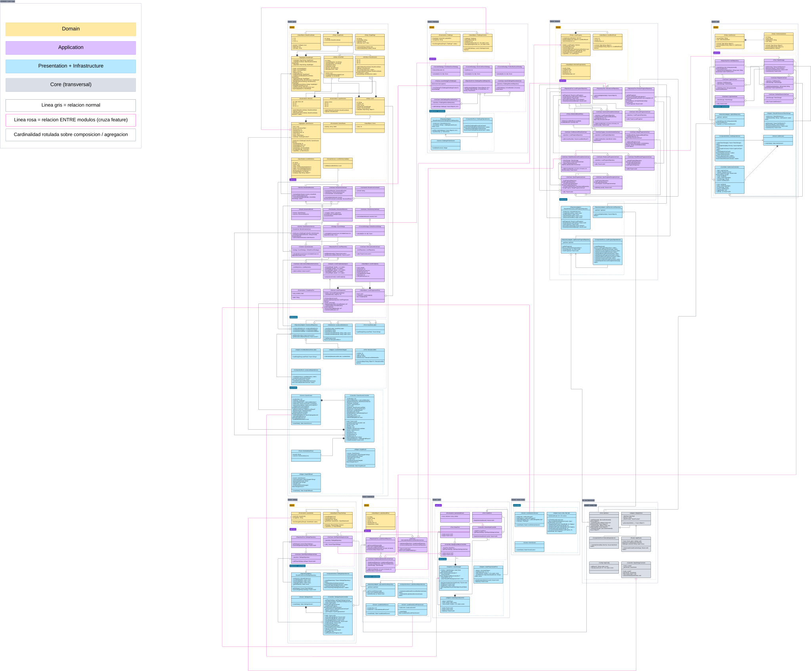
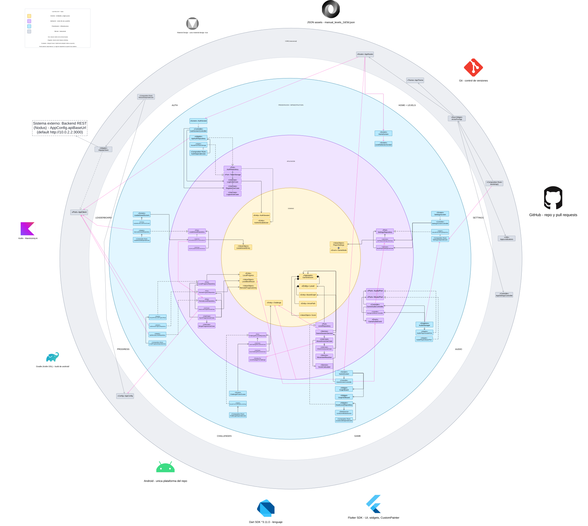

# Nodus


Flutter graph-based puzzle game. Player-facing client only — see [`backend-poc-arrow`](https://github.com/arjperez-dev/backend-poc-arrow) for the server.

---

## Description

Nodus is a graph-based puzzle game: each level is a graph of nodes and edges covered by rigid arrows. Tapping an arrow attempts a full exit in its head direction; the arrow either escapes the board entirely or the move is rolled back. The game ships 2D and 3D level sets, with an optional online account for progress sync and leaderboards.


## Tech Stack

| Layer | Technology |
|---|---|
| Framework | Flutter / Dart |
| Architecture | Clean Architecture (Domain → Application → Infrastructure → Presentation) |
| Networking | `http` package |
| Storage | `shared_preferences` |
| Audio | `audioplayers` |
| CI | GitHub Actions |

---

## Architecture — Clean Architecture

The app follows a strict **four-layer Clean Architecture** split per feature. Domain and application code stays pure Dart — no Flutter, HTTP, or storage imports.

```text
lib/
  core/                  cross-cutting concerns
    app/                 bootstrap, app widget, settings controller
    config/              compile-time configuration (API_BASE_URL)
    network/             ApiClient interface + HttpApiClient adapter
    routing/             named route definitions
    storage/             storage abstractions
    theme/               app-wide theme
    localization/        i18n (English + Spanish)
    errors/              error types
  features/
    <feature>/
      domain/            entities, value objects, pure Dart rules
      application/       use cases, ports, services
      infrastructure/    adapters: HTTP, SharedPreferences, assets
      presentation/      screens, controllers, widgets
```

Every feature (`game`, `auth`, `levels`, `progress`, `leaderboard`, `settings`, `challenges`, `home`, `audio`) follows the same four-layer split under `lib/features/<feature>/`.

### Project Structure

```text
lib/
  core/
  features/
assets/
  audio/       sound effects and background music
  fonts/       PixelGame custom font
  levels/      manual_levels_2d.json, manual_levels_3d.json
test/
tool/          level generator/validator (gen_levels.js)
docs/
harness/
```

### Class Diagram


### Clean Architecture Layers Diagram


**[View diagrams in Lucidchart](https://lucid.app/lucidchart/91a6320b-13f7-4069-8927-291808d3df97/edit?viewport_loc=-8338%2C-5684%2C17380%2C11248%2C0D3b0m6F7NPD&invitationId=inv_214f2076-e9ff-4c87-8d51-6b451a2b95e5)**


---

## SOLID Principles

Below are concrete examples of each SOLID principle as applied in the Flutter codebase:

### S — Single Responsibility Principle

Each class has one reason to change.

- [`MovementResolver`](lib/features/game/application/movement_resolver.dart) has the sole responsibility of determining whether an arrow's full-exit attempt results in an escape or a collision. It never manages game state, UI, or persistence.
- [`SaveLevelCompletionUseCase`](lib/features/progress/application/save_level_completion_use_case.dart) is responsible only for saving a completed level's best result and unlocking the next level — it delegates comparison logic to `BestLevelResultPolicy`.
- [`GameScreenController`](lib/features/game/presentation/game_screen_controller.dart) only manages presentation state (loading, animating, notifying listeners). Gameplay rules live in `GameSessionService` and `MoveArrowUseCase`.

### O — Open/Closed Principle

Classes are open for extension but closed for modification.

- [`ScoreStrategy`](lib/features/game/application/score_strategy.dart) is an abstract interface with a default implementation (`DefaultScoreStrategy`). Challenge modes provide alternative strategies (e.g. time-weighted scoring) without modifying the core `ScoreCalculator` or `MoveArrowUseCase`.
- Adding a new feature (e.g. `challenges`) means adding a new `lib/features/challenges/` directory with its own layers — existing features are untouched.

### L — Liskov Substitution Principle

Any implementation of a port can be transparently substituted.

- [`LocalProgressRepository`](lib/features/progress/application/local_progress_repository.dart) is an abstract interface. Its production implementation ([`SharedPreferencesLocalProgressRepository`](lib/features/progress/infrastructure/shared_preferences_local_progress_repository.dart)) is seamlessly replaced by in-memory fakes in unit tests — use cases never know the difference.
- [`ApiClient`](lib/core/network/api_client.dart) is an abstract interface implemented by [`HttpApiClient`](lib/core/network/http_api_client.dart). Tests substitute a mock client without touching any use case code.

### I — Interface Segregation Principle

Ports are small and focused — no client is forced to implement methods it does not need.

- Progress has three separate repository interfaces: [`LocalProgressRepository`](lib/features/progress/application/local_progress_repository.dart) (read/write local data), [`RemoteProgressRepository`](lib/features/progress/application/remote_progress_repository.dart) (sync with server), and [`RemoteLevelRepository`](lib/features/progress/application/remote_level_repository.dart) (resolve backend level IDs).
- The audio layer separates `AudioPort` (SFX) from `MusicPort` (background music) rather than combining them into a single interface.

### D — Dependency Inversion Principle

High-level modules depend on abstractions, not on low-level modules.

- [`SyncProgressUseCase`](lib/features/progress/application/sync_progress_use_case.dart) depends on `LocalProgressRepository`, `RemoteProgressRepository`, and `RemoteLevelRepository` — all abstract interfaces. It never imports `SharedPreferences`, `http.Client`, or any infrastructure class directly.
- [`GameSessionService`](lib/features/game/application/game_session_service.dart) depends on `MoveArrowUseCase` (which itself depends on abstractions like `MovementResolver` and `ScoreCalculator`), keeping the entire game engine framework-free and testable in pure Dart.

---

## Design Patterns (GoF)

| Pattern | Category | Where | Purpose |
|---|---|---|---|
| **Strategy** | Behavioural | [`ScoreStrategy`](lib/features/game/application/score_strategy.dart) + `DefaultScoreStrategy` + challenge strategies | Selects the scoring algorithm at runtime. Campaign mode and each challenge type use different strategies without modifying the game flow. |
| **Observer** | Behavioural | [`GameScreenController`](lib/features/game/presentation/game_screen_controller.dart) extends `ChangeNotifier` | The UI subscribes to state changes via `addListener` / `notifyListeners()`. When game state mutates, the view rebuilds automatically. |
| **Singleton** | Creational | [`AudioManager.instance`](lib/features/audio/infrastructure/audio_manager.dart) | Ensures a single point of control for native audio players across the app lifecycle, preventing memory leaks from recreated players. |
| **Facade** | Structural | [`AudioManager`](lib/features/audio/infrastructure/audio_manager.dart) | Provides a simplified interface to two subsystems (`GameAudioController` for SFX, `BackgroundMusicController` for music), hiding their creation, lifecycle, and reference-counting from callers. |
| **Adapter** | Structural | [`SharedPreferencesLocalProgressRepository`](lib/features/progress/infrastructure/shared_preferences_local_progress_repository.dart), [`HttpApiClient`](lib/core/network/http_api_client.dart) | Adapts external APIs (`SharedPreferences`, `http.Client`) to the abstract interfaces defined in the application layer. |
| **Command** | Behavioural | [`MoveArrowCommand`](lib/features/game/application/move_arrow_command.dart) | Encapsulates the intent of tapping an arrow (arrow ID) into a data object, decoupling the UI gesture from the use case invocation. |
| **Policy** | Behavioural | [`BestLevelResultPolicy`](lib/features/progress/application/best_level_result_policy.dart) | Encapsulates the comparison rule for determining whether a new score is better than the stored best (score → moves → time). Same pattern as the backend's `LeaderboardScorePolicy`. |

---

## AOP — Aspect-Oriented Programming

Cross-cutting concerns are separated from business logic using wrapper/interceptor patterns:

### Centralised Network Error Handling

[`HttpApiClient`](lib/core/network/http_api_client.dart) intercepts **every** HTTP call. All network errors, unexpected status codes, and deserialization failures are caught in a single `_send` method and uniformly wrapped into an [`ApiException`](lib/core/network/api_exception.dart). No use case or repository ever needs its own try/catch for HTTP errors — the cross-cutting concern is handled in one place.

### Transparent Token Injection

`HttpApiClient` uses a `TokenProvider` callback to **automatically** attach the `Authorization: Bearer <token>` header to every authenticated request. Controllers, use cases, and infrastructure repositories are completely unaware of token storage — the concern is injected transparently at the network boundary.

### App Lifecycle Observation

[`AudioManager`](lib/features/audio/infrastructure/audio_manager.dart) implements `WidgetsBindingObserver` to **intercept** app lifecycle events (pause, resume) and automatically pause/resume background music. This cross-cutting lifecycle concern is separated from the game screen and settings screens that trigger music playback.

### Global Validation Pipe (Backend Parallel)

On the Flutter side, the [`LevelDefinitionValidator`](lib/features/game/domain/level_definition_validator.dart) acts as a validation gate that runs structural checks (nodes, edges, arrows, connectivity) on every level loaded from JSON assets — analogous to the backend's global `ValidationPipe`. Invalid levels are rejected before they reach the game engine.

---

## Key Features

- **Graph-based gameplay:** full-exit arrow attempts, rigid-piece collision, lives / game-over
- **2D and 3D level modes** with separate level sets
- **Audio:** sound effects and background music (with app lifecycle awareness)
- **Optional auth:** login / register; logged-out play fully supported
- **Local-first progress** with optional remote sync
- **Leaderboard:** per-level scores when authenticated
- **Challenges:** separate difficulty modes (Time Attack, Perfectionist, etc.)
- **Settings:** sound, music, language (English / Spanish)
- **Pan & zoom:** pinch-zoom and drag on dense boards, with reset-view button

---

## Getting Started

### Prerequisites

- **Flutter SDK** (stable channel, Dart ≥ 3.11)
- **Android Studio** or an Android emulator (for mobile testing)
- **Node.js** (only if running the level generator tool)

### Installation

```powershell
# 1. Clone the repository
git clone https://github.com/arjperez-dev/frontend-poc-arrow.git
cd frontend-poc-arrow

# 2. Install dependencies
flutter pub get

# 3. Generate localisation files
flutter gen-l10n
```

### Run

```powershell
# Run on connected device / emulator
flutter run

# Point at a backend (Android emulator example)
flutter run --dart-define=API_BASE_URL=http://10.0.2.2:3000

# Run tests
flutter test

# Static analysis
flutter analyze
```

---

## Level Authoring / Validation

See [`docs/LEVEL_AUTHORING.md`](docs/LEVEL_AUTHORING.md) for the full guide.

```powershell
node tool/gen_levels.js --validate-only   # default; reads and checks, never writes
node tool/gen_levels.js --generate-2d
node tool/gen_levels.js --generate-3d
node tool/gen_levels.js --generate        # runs both generators
```

`assets/levels/manual_levels_2d.json` (levels 1–20) and `assets/levels/manual_levels_3d.json` (levels 21+) are the authoritative, tool-validated level data.

---

## Testing

```powershell
flutter test        # all unit + widget tests
flutter analyze     # Dart static analysis
```

Tests use in-memory fakes / mocks for repositories and network clients (Liskov Substitution in action), ensuring fast and deterministic execution.

---

## CI / CD

GitHub Actions runs on every push and PR to `main`:

- **Analyse:** `flutter analyze`
- **Test:** `flutter test`

See [`.github/workflows/flutter.yml`](.github/workflows/flutter.yml).

---

## AI Usage

AI-assisted development is documented in [`AI_USAGE.md`](AI_USAGE.md). Each entry records the date, tool/model, task, prompt, result, team modifications, lessons learned, and critical reflection.

---

## Contributing

1. Create a feature branch from `main`: `git checkout -b feat/your-feature`
2. Follow [Conventional Commits](https://www.conventionalcommits.org/) for commit messages (`feat:`, `fix:`, `docs:`, etc.)
3. Run `flutter analyze` and `flutter test` before pushing.
4. Open a Pull Request and request review.

---

## License

This project is licensed under the [MIT License](LICENSE).
